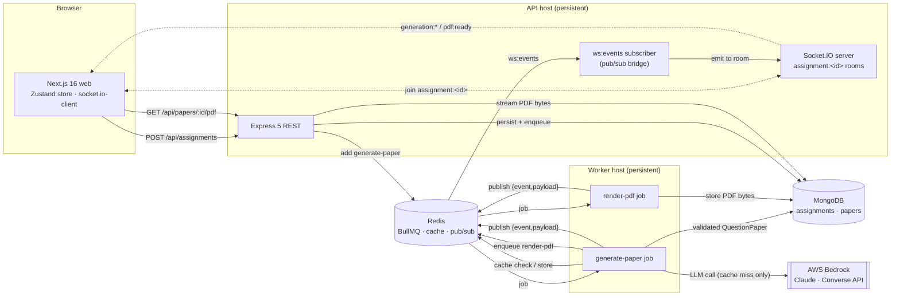

# VedaAI Assessment Creator

A teacher fills in an assignment (optional PDF/text upload, due date, question
types, counts + marks, instructions). The system generates a structured question
paper with an LLM **as a background job**, streams **real-time progress** to the
browser over WebSocket, stores the validated result, and renders it as a clean,
exam-paper-style page with a PDF export.

The interesting part is the *plumbing and the parsing discipline*, not feature
breadth. The hardest rule, enforced end to end: **never render the raw LLM
response.** Model output is validated against a Zod schema, the validated object
is stored, and every renderer (web and PDF) draws only from stored, validated
data.

> `CLAUDE.md` is the single source of truth for the shared contract (enums,
> schemas, REST + WebSocket + queue shapes). This README explains how the pieces
> fit together and why.

---

## Architecture

A pnpm + Turborepo monorepo with three runtimes (web, api, worker) and two shared
packages (`shared` = the contract, `db` = models + connections). MongoDB stores
state; Redis is the BullMQ broker, the paper cache, **and** the pub/sub bridge
that lets the worker push real-time updates without owning any sockets.



### Repository layout

```
apps/
  web/      # Next.js 16 (App Router) + Tailwind v4 — create + output UI, realtime client
  api/      # Express 5 + Socket.IO (ESM) — REST, the pub/sub bridge, PDF streaming
  worker/   # BullMQ worker (ESM) — generate-paper + render-pdf jobs
packages/
  shared/   # Zod schemas, inferred types, enums, constants (the wire contract)
  db/       # Mongoose 8 models + connectMongo + ioredis client factories
```

`packages/shared` and `packages/db` are the contract. Treat them as read-only
from inside `apps/*`: import from them, never redefine their types locally.

---

## Data-flow narrative

1. **Create.** The browser submits the form. The same `CreateAssignmentInput`
   Zod schema validates it client-side (react-hook-form + zod resolver) and
   server-side (Express middleware) — one schema, both ends.
2. **Persist + enqueue.** `POST /api/assignments` saves the assignment
   (`status: "queued"`), enqueues a `generate-paper` BullMQ job, and returns
   `{ assignmentId, jobId }`. The client joins Socket.IO room
   `assignment:<assignmentId>` and optimistically shows "queued".
3. **Generate (worker).** The worker marks the assignment `active`, then checks
   the **paper cache** (see below). On a miss it builds a deterministic prompt
   and calls Bedrock (Converse API, structured outputs). The returned JSON is
   re-validated against the Zod `QuestionPaper` schema with **one repair
   round-trip**; a second failure fails the job.
4. **Store.** The worker assigns ids, **recomputes `totalMarks`** from the
   questions (the model's own total is never trusted), persists the validated
   paper, caches it, and enqueues `render-pdf`.
5. **Realtime.** The worker is a separate process and never touches sockets. It
   **publishes** `{ event, payload }` JSON to the Redis `ws:events` channel; the
   API **subscribes** on a dedicated connection and re-emits each event to room
   `assignment:<id>`. The browser updates a Zustand store from those events
   (`generation:active → progress → completed`, then `pdf:ready`). The client
   re-joins its room and re-syncs assignment/PDF state on every (re)connect and
   refresh, so a dropped socket never loses progress or a missed
   `completed`/`pdf:ready` event.
6. **Render.** The output page renders the `QuestionPaper` from the store (never
   raw model text) and shows the answer key inline. `render-pdf` produces
   exam-paper PDF bytes server-side with `@react-pdf/renderer` (no headless
   browser) and stores them on the paper; `GET /api/papers/:id/pdf` streams them
   and the browser fetches those bytes as a blob to save the file client-side
   (reliable across the API's separate origin). If a render fails after its
   retries, the worker emits `pdf:failed` and the download button surfaces a real
   error + a **Try again** that re-renders via `POST /api/papers/:id/pdf` (no LLM
   re-run) instead of a download that silently 404s forever.

---

## The "never render raw LLM output" decision

This is the central correctness rule and it is enforced structurally, not by
convention:

- The model is called with **structured outputs** (a JSON Schema derived from the
  `QuestionPaper` shape) and its response is **re-validated** with the Zod
  `QuestionPaper` schema in the worker. Invalid output gets exactly one repair
  attempt; still invalid → the job fails (`generation:failed`).
- Only the **validated** object is written to MongoDB. Server-assigned fields
  (ids, `totalMarks`, `generatedAt`) are computed by us, not the model.
- Both renderers — the web `QuestionPaperView` and the worker `PaperDocument`
  (PDF) — take a typed `QuestionPaper` as input. There is no code path that
  interpolates raw model text into the UI or the PDF.

---

## Deliberate decisions

- **Zustand for generation state.** A single store holds `status / progress /
  stage / paper / pdfUrl / pdfError / error`, fed by the socket subscription. It keeps the
  realtime lifecycle out of component state and lets the create flow, progress
  view, and output page read one consistent source.
- **Socket.IO rooms (`assignment:<id>`).** Each assignment gets its own room so
  an event is delivered only to the client(s) watching that assignment — no
  client-side filtering, no cross-talk between concurrent generations.
- **Redis pub/sub bridge.** The worker doesn't own the Socket.IO server, so it
  publishes events to the `ws:events` Redis channel and the API re-emits them to
  the right room. This keeps the worker horizontally scalable and process-
  isolated while still driving the browser. A subscriber connection can't run
  normal commands, so the bridge uses a dedicated ioredis connection.
- **Paper caching (observable + deliberate).** The cache key is a stable hash of
  the normalized `CreateAssignmentInput` (sorted keys). On a hit the worker
  reuses the cached content with fresh ids and **skips the LLM entirely** (saving
  latency and cost); identical inputs are deterministic. Entries live under
  `paper:<hash>` with a TTL. **Every generation logs exactly one cache line** so
  the behavior is visible, e.g.:

  ```
  [worker] generate-paper 665f… — paper cache MISS (calling LLM) key=paper:ab12…
  [worker] generate-paper 665f… — paper cache HIT (reusing, no LLM call) key=paper:ab12…
  ```

- **PDF-as-job.** PDF rendering runs as its own `render-pdf` BullMQ job (not
  inline in the request) and uses `@react-pdf/renderer` (`renderToBuffer`, no
  headless browser) so it stays friendly to small hosts. Bytes are stored on the
  paper document and streamed from `GET /api/papers/:id/pdf`; the browser is told
  via `pdf:ready`. The PDF has real typographic hierarchy, page-break-safe
  sections, a page-number footer, and **color-coded difficulty badges that share
  one palette with the web UI** (`DIFFICULTY_COLORS` in `packages/shared`), so
  the printed paper matches what's on screen.

---

## Prerequisites

- Node 20+
- pnpm 11 (`corepack enable`)
- Docker (for local Mongo + Redis)
- An AWS Bedrock API key with access to the configured Claude model (for real
  generation; the rest of the app runs without it)

## One-command local setup

```bash
pnpm install
cp .env.example .env         # fill in AWS_BEARER_TOKEN_BEDROCK for real generation
docker compose up -d         # start local mongo + redis
pnpm dev                     # run web + api + worker in watch mode (Turborepo)
```

Then open the web app at `http://localhost:3000` (API on `http://localhost:4000`).

Useful variations:

```bash
pnpm build                   # build all packages/apps
pnpm test                    # run unit + integration tests
pnpm typecheck               # type-check every workspace

# Preview the full UI flow with no backend (in-memory mock of REST + realtime):
NEXT_PUBLIC_USE_MOCK=true pnpm --filter @veda-ai/web dev
```

## Environment variables

Documented in `.env.example`. Never commit real secrets. Each app reads env vars
**only** through its typed config module (`apps/*/src/config.ts`); never read
`process.env` ad hoc elsewhere.

A single root `.env` configures `api` + `worker`; `web` reads `NEXT_PUBLIC_*`.

| Var | Used by | Required | Purpose |
|-----|---------|:---:|---------|
| `MONGODB_URI` | api, worker | – | MongoDB connection string (defaults to local) |
| `REDIS_URL` | api, worker | – | Redis connection string (defaults to local) |
| `AWS_REGION` | worker | – | AWS region hosting the Bedrock model/profile |
| `BEDROCK_MODEL_ID` | worker | – | Bedrock model id / cross-region inference profile |
| `BEDROCK_MAX_TOKENS` | worker | – | Max output tokens per generation call |
| `AWS_BEARER_TOKEN_BEDROCK` | worker | ✓\* | Bedrock API key. Without it, `generate-paper` jobs fail (the rest of the app still runs) |
| `PORT` | api | – | Express listen port (default `4000`) |
| `CLIENT_ORIGIN` | api | – | CORS allowed origin (default `http://localhost:3000`) |
| `NEXT_PUBLIC_API_URL` | web | – | REST base URL (browser) |
| `NEXT_PUBLIC_WS_URL` | web | – | WebSocket URL (browser) |
| `NEXT_PUBLIC_USE_MOCK` | web | – | `true` runs the UI against an in-memory mock (no backend) |

\* Required only for real generation against Bedrock.

See `CLAUDE.md` for the full contract (schemas, REST + WebSocket + queue contracts).
